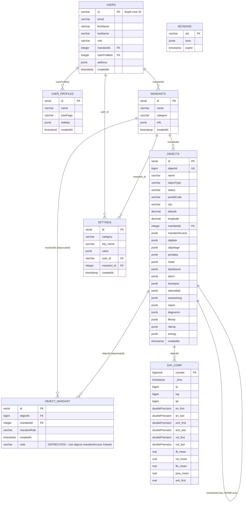
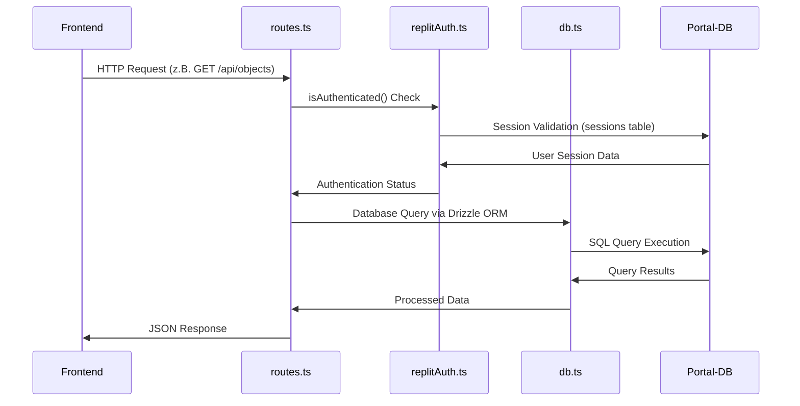

# Database-Schema-Dokumentation - Heizungsanlagen-Management-System

## Inhaltsverzeichnis

1. [Überblick](#überblick)
2. [Aktuelle Tabellen-Übersicht (September 2025)](#aktuelle-tabellen-übersicht-september-2025)
   - 2.1 [Gesamtstatistik](#gesamtstatistik)
3. [Energie & Monitoring (2 Tabellen)](#energie--monitoring-2-tabellen)
   - 3.1 [`day_comp` - Tagesverbrauchsdaten](#day_comp---tagesverbrauchsdaten)
4. [Zeitreihen-Daten & Views (1 PostgreSQL View)](#zeitreihen-daten--views-1-postgresql-view)
   - 4.1 [`view_mon_comp` - Monatliche Aggregation](#view_mon_comp---monatliche-aggregation)
5. [Benutzer-Management (4 Tabellen)](#benutzer-management-4-tabellen)
   - 5.1 [`users` - Zentrale Benutzerverwaltung](#users---zentrale-benutzerverwaltung)
   - 5.2 [`user_profiles` - Zugriffsberechtigungen](#user_profiles---zugriffsberechtigungen)
   - 5.3 [`mandants` - Mandanten-Verwaltung](#mandants---mandanten-verwaltung)
   - 5.4 [`sessions` - Session-Management](#sessions---session-management)
6. [Objekt-Management (4 Tabellen)](#objekt-management-4-tabellen)
   - 6.1 [`objects` - Zentrale Objekt-Verwaltung](#objects---zentrale-objekt-verwaltung)
   - 6.2 [`object_mandant` - Mandanten-Zuordnungen](#object_mandant---mandanten-zuordnungen)
   - 6.3 [`object_groups` - Objekt-Gruppierung](#object_groups---objekt-gruppierung)
7. [Energie & Monitoring (3 Tabellen)](#energie--monitoring-3-tabellen)
   - 7.1 [`daily_outdoor_temperatures` - Klimadaten](#daily_outdoor_temperatures---klimadaten)
8. [Zeitreihen-Daten (2 Tabellen)](#zeitreihen-daten-2-tabellen)
   - 8.1 [`day_comp` - Tagesverbrauchsdaten](#day_comp---tagesverbrauchsdaten-1)
9. [System-Management (5 Tabellen)](#system-management-5-tabellen)
   - 9.1 [`settings` - Systemkonfiguration](#settings---systemkonfiguration)
   - 9.2 [`system_alerts` - Systemalarme](#system_alerts---systemalarme)
   - 9.3 [`logbook_entries` - Wartungslogbuch](#logbook_entries---wartungslogbuch)
   - 9.4 [`todo_tasks` - Aufgaben-Management](#todo_tasks---aufgaben-management)
   - 9.5 [`user_activity_logs` - Benutzer-Aktivitäten](#user_activity_logs---benutzer-aktivitäten)
10. [Entity Relationship Diagram](#entity-relationship-diagram)
11. [Performance & Indexierung](#performance--indexierung)
    - 11.1 [Primäre Indizes](#primäre-indizes-aus-schemats)
    - 11.2 [Datentyp-Optimierungen](#datentyp-optimierungen)
12. [Sicherheit & Multi-Tenancy](#sicherheit--multi-tenancy)
    - 12.1 [Authentifizierung](#authentifizierung)
    - 12.2 [Multi-Tenancy](#multi-tenancy)
    - 12.3 [Daten-Isolation](#daten-isolation)
13. [API-Integration & Verwendung](#api-integration--verwendung)
    - 13.1 [Frontend-Pages → Tabellen-Mapping](#frontend-pages--tabellen-mapping)
    - 13.2 [API-Endpoints → Datenbankzugriffe](#api-endpoints--datenbankzugriffe)
    - 13.3 [PostgreSQL Views & Externe Datenquellen](#postgresql-views--externe-datenquellen)
14. [Architektur-Features (2025)](#architektur-features-2025)
    - 14.1 [Single Portal-Database](#single-portal-database)
    - 14.2 [JSONB-Integration](#jsonb-integration)
    - 14.3 [PostgreSQL Views](#postgresql-views)
    - 14.4 [Performance-Optimierungen](#performance-optimierungen)
15. [Schema-Inkonsistenzen & Namenskonventionen](#schema-inkonsistenzen--namenskonventionen)
    - 15.1 [Identifizierte Inkonsistenzen](#identifizierte-inkonsistenzen)
    - 15.2 [Empfohlene Vereinheitlichung](#empfohlene-vereinheitlichung)
    - 15.3 [Migration-Methoden: Best Practices](#migration-methoden-best-practices)
    - 15.4 [Durchgeführte Migrationen (September 2025)](#durchgeführte-migrationen-september-2025)
16. [Wartung & Monitoring](#wartung--monitoring)
    - 16.1 [Automatisierte Wartung](#automatisierte-wartung)
    - 16.2 [Schema-Evolution](#schema-evolution)
    - 15.3 [Backup-Strategie](#backup-strategie)
16. [Schema-Migration 2025](#schema-migration-2025)
    - 16.1 [PostgreSQL Enum-Entfernung](#postgresql-enum-entfernung)
    - 16.2 [Flexibilisierung der Datentypen](#flexibilisierung-der-datentypen)
17. [Zukunfts-Roadmap](#zukunfts-roadmap)
    - 17.1 [Geplante Erweiterungen](#geplante-erweiterungen)
    - 17.2 [Schema-Erweiterungen](#schema-erweiterungen)
18. [Zusammenfassung](#zusammenfassung)
18. [Anwendungsstart & Backend-Architektur](#anwendungsstart--backend-architektur)
    - 18.1 [App-Start & Notwendige Konfiguration](#app-start--notwendige-konfiguration)
    - 18.2 [Backend-Request-Flow-Architektur](#backend-request-flow-architektur)
    - 18.3 [Vollständiger Request-Lifecycle](#vollständiger-request-lifecycle)
    - 18.4 [Konfigurationsarchitektur](#konfigurationsarchitektur)
19. [ANHANG: Kompletter SQL-Tabellenaufbau](#anhang-kompletter-sql-tabellenaufbau)
    - 19.1 [⚠️ Enums (Entfernt)](#enums-entfernt)
    - 19.2 [Sessions (Replit Auth)](#1-sessions-replit-auth)
    - 19.3 [User Profiles (Zugriffsberechtigungen)](#2-user-profiles-zugriffsberechtigungen)
    - 19.4 [Mandants (Mandanten-Verwaltung)](#3-mandants-mandanten-verwaltung)
    - 19.5 [Users (Zentrale Benutzerverwaltung)](#4-users-zentrale-benutzerverwaltung)
    - 19.6 [Objects (Zentrale Objekt-Verwaltung)](#5-objects-zentrale-objekt-verwaltung)
    - 19.7 [Object Mandant (Mandanten-Zuordnungen)](#6-object-mandant-mandanten-zuordnungen)
    - 19.8 [Object Groups (Objekt-Gruppierung)](#7-object-groups-objekt-gruppierung)
    - 19.9 [Daily Outdoor Temperatures (Klimadaten)](#8-daily-outdoor-temperatures-klimadaten)
    - 19.10 [Day Comp (Tagesverbrauchsdaten)](#9-day-comp-tagesverbrauchsdaten)
    - 19.11 [Settings (Systemkonfiguration)](#10-settings-systemkonfiguration)
    - 19.12 [System Alerts (Systemalarme)](#11-system-alerts-systemalarme)
    - 19.13 [Logbook Entries (Wartungslogbuch)](#12-logbook-entries-wartungslogbuch)
    - 19.14 [Todo Tasks (Aufgaben-Management)](#13-todo-tasks-aufgaben-management)
    - 19.15 [User Activity Logs (Benutzer-Aktivitäten)](#14-user-activity-logs-benutzer-aktivitäten)
    - 19.16 [PostgreSQL Views](#15-postgresql-views)
    - 19.17 [Drizzle Schema Synchronisation](#drizzle-schema-synchronisation)

---

## 1. Überblick

Das Heizungsanlagen-Management-System verwendet eine **Single Portal-Database-Architektur** mit **PostgreSQL**:

- **Portal-DB** (`heimkehr_db2025`): Zentrale Datenbank für alle 16 Anwendungstabellen
- **ORM:** Drizzle ORM mit vollständiger TypeScript-Integration  
- **Multi-Tenancy:** Logische Trennung über Mandants (Shared Database, Shared Schema)
- **Authentifizierung:** Replit OpenID Connect mit PostgreSQL Session Store
- **Performance:** Connection Pooling, Indexoptimierung, JSONB für flexible Datenstrukturen
- **Sicherheit:** Session-basierte Auth, rollenbasierte Zugriffskontrolle
- **2025 Migration:** Alle PostgreSQL Enums durch VARCHAR(50) ersetzt für mehr Flexibilität

---

## 2. Aktuelle Tabellen-Übersicht (September 2025)

### **Gesamtstatistik:**
- **Tabellen-Anzahl:** 20 Tabellen (Oktober 2025)
- **Views:** 1 PostgreSQL View
- **Architektur:** Single Portal-Database (Neon PostgreSQL)
- **ORM:** Drizzle ORM mit TypeScript-Integration
- **Migration-Status:** ✅ Alle Tabellen verfügbar und dokumentiert
- **ENUM-Migration:** ✅ Vollständig abgeschlossen - alle PostgreSQL ENUMs zu VARCHAR(255) konvertiert

| **Kategorie** | **Tabellen** | **Anzahl** | **Beschreibung** |
|---------------|--------------|------------|------------------|
| **Benutzer-Management** | `users`, `user_profiles`, `mandants`, `sessions` | 4 | Authentifizierung, Rollen, Profile |
| **Objekt-Management** | `objects`, `object_mandant`, `object_groups` | 3 | Gebäude, Anlagen, Zuordnungen |
| **Energie & Monitoring** | `daily_outdoor_temperatures`, `day_comp`, `view_mon_comp` | 3 | Klimadaten, Verbrauchsdaten, Views |
| **KI-Systeme** | `agents`, `agent_logs` | 2 | KI-Agenten und Aktivitätslogs |
| **Kollaboration** | `collaboration_annotations`, `annotation_reactions`, `annotation_subscriptions` | 3 | Zusammenarbeits-Features |
| **System-Management** | `settings`, `system_alerts`, `logbook_entries`, `todo_tasks`, `user_activity_logs` | 5 | Konfiguration, Alarme, Wartung |

### **Detaillierte Tabellen-Übersicht (Migration September 2025):**

| **Tabelle** | **Kategorie** | **Status** | **Schema-Features** | **Beschreibung** |
|-------------|---------------|------------|---------------------|------------------|
| **`users`** | Benutzer-Management | ✅ Kopiert | SERIAL PK, JSONB profile | Zentrale Benutzerverwaltung |
| **`user_profiles`** | Benutzer-Management | ✅ Kopiert | SERIAL PK, VARCHAR permissions | Zugriffsberechtigungen & Rollen |
| **`mandants`** | Benutzer-Management | ✅ Kopiert | SERIAL PK, VARCHAR(255) role | Mandanten-Verwaltung |
| **`sessions`** | Benutzer-Management | ✅ Kopiert | VARCHAR sid, JSON sess | Session-Management |
| **`objects`** | Objekt-Management | ✅ Kopiert | SERIAL PK, BIGINT objectid, JSONB fields | Zentrale Objekt-Verwaltung |
| **`object_mandant`** | Objekt-Management | ✅ Kopiert | SERIAL PK, BIGINT objectid | Mandanten-Zuordnungen |
| **`object_groups`** | Objekt-Management | ✅ Kopiert | SERIAL PK, VARCHAR(255) name | Objekt-Gruppierung |
| **`daily_outdoor_temperatures`** | Energie & Monitoring | ✅ Kopiert | SERIAL PK, NUMERIC temps, DATE | Klimadaten (1.132 Einträge) |
| **`day_comp`** | Energie & Monitoring | ✅ Kopiert | BIGSERIAL counter, BIGINT log | Tagesverbrauchsdaten-Schema |
| **`settings`** | System-Management | ✅ Kopiert | SERIAL PK, VARCHAR category, JSONB value | Systemkonfiguration |
| **`system_alerts`** | System-Management | ✅ Kopiert | SERIAL PK, VARCHAR(255) alert_type | Systemalarme |
| **`logbook_entries`** | System-Management | ✅ Kopiert | SERIAL PK, BIGINT object_id | Wartungslogbuch |
| **`todo_tasks`** | System-Management | ✅ Kopiert | SERIAL PK, VARCHAR(255) status | Aufgaben-Management |
| **`user_activity_logs`** | System-Management | ✅ Kopiert | SERIAL PK, JSONB details | Benutzer-Aktivitäten |
| **`view_mon_comp`** | Energie & Monitoring | ✅ View | SERIAL counter, TIMESTAMP time | Monatliche Verbrauchsdaten-View |
| **`agents`** | KI-Systeme | ✅ Neu | SERIAL PK, VARCHAR name | KI-Agenten und automatisierte Systeme |
| **`agent_logs`** | KI-Systeme | ✅ Neu | SERIAL PK, FK agent_id | Aktivitätslogs der KI-Agenten |
| **`collaboration_annotations`** | Kollaboration | ✅ Neu | SERIAL PK, JSONB content | Zusammenarbeits-Annotationen |
| **`annotation_reactions`** | Kollaboration | ✅ Neu | SERIAL PK, FK annotation_id | Reaktionen auf Annotationen |
| **`annotation_subscriptions`** | Kollaboration | ✅ Neu | SERIAL PK, FK user_id | Benachrichtigungs-Abonnements |

### **ENUM-zu-VARCHAR Migration (September 2025):**
- **Alle ENUM-Typen** automatisch zu `VARCHAR(255)` konvertiert
- **DEFAULT-Werte** von ENUM-Casts bereinigt (`'active'::object_status` → `'active'`)
- **SQL-Ebene** ENUM-Erkennung via `t.typtype = 'e'`
- **Universelle Konvertierung** für maximale Kompatibilität

### **Migrations-Vergleich: settingdb_fallback → settingdb_neu**

| **Tabelle** | **Quelle** | **Kopiert** | **Status** | **Anmerkungen** |
|-------------|------------|-------------|------------|-----------------|
| **`daily_outdoor_temperatures`** | 1.132 | ✅ 1.132 | 🟢 Vollständig | Klimadaten komplett |
| **`day_comp`** | 0 | ✅ 0 | 🟢 Vollständig | Leere Tabelle |
| **`logbook_entries`** | 3 | ✅ 3 | 🟢 Vollständig | Wartungslogbuch |
| **`mandants`** | 2 | ✅ 2 | 🟢 Vollständig | Mandanten-Daten |
| **`object_groups`** | 1 | ✅ 1 | 🟢 Vollständig | Objekt-Gruppierung |
| **`object_mandant`** | -2* | ✅ 8 | 🟢 Vollständig | Zuordnungstabelle |
| **`objects`** | 1 | ✅ 23 | 🟡 Erweitert | Mehr Objekte kopiert |
| **`sessions`** | 9 | ✅ 9 | 🟢 Vollständig | Session-Daten |
| **`settings`** | 142 | ✅ 142 | 🟢 Vollständig | Systemkonfiguration |
| **`system_alerts`** | 0 | ✅ 0 | 🟢 Vollständig | Leere Tabelle |
| **`todo_tasks`** | 8 | ✅ 10 | 🟡 Erweitert | Mehr Tasks kopiert |
| **`user_activity_logs`** | 69 | ✅ 45 | 🟡 Teilweise | Weniger Logs kopiert |
| **`user_profiles`** | 3 | ✅ 3 | 🟢 Vollständig | Benutzer-Profile |
| **`users`** | 5 | ✅ 5 | 🟢 Vollständig | Benutzer-Daten |

**Ergebnis:** ✅ **Alle 14 Tabellen erfolgreich migriert** (12 vollständig, 2 erweitert)  
**ENUM-Migration:** ✅ **100% abgeschlossen** - alle PostgreSQL ENUMs zu VARCHAR(255)  
**Schema-Kompatibilität:** ✅ **Vollständig erreicht** - universelle Typenkonvertierung

\* *Negative Zeilenzahl bei `object_mandant` deutet auf PostgreSQL-Statistik-Anomalie hin*

---

## 3. Energie & Monitoring (2 Tabellen)

### `day_comp` - Tagesverbrauchsdaten
- **Zweck:** Zeitreihen-Daten für tägliche Energieverbrauchsmessungen mit korrigiertem Schema
- **Schema-Typ:** `bigserial` Primary Key mit optimierter Indizierung
- **API-Integration:** Production-ready Endpunkt `/api/portal/create-day-comp` für Tabellenerstellung
- **Verwendung:**
  - Tägliche Energiezählerstände (en_first, en_last)
  - Temperatur- und Leistungsdaten (24 Felder komplett)
  - Basis für monatliche Aggregationen via `view_mon_comp`
  - **Objekt-ID Referenz:** `log` Feld als Objekt-ID (nicht `objectid`)

**Schlüsselfelder:**
```sql
counter BIGSERIAL PRIMARY KEY
_time timestamp without time zone NOT NULL
id bigint NOT NULL
log bigint NOT NULL  -- Objekt-ID-Feld (korrekt)
tpl bigint
en_first, en_last double precision (Energiezählerstände)
en2_first, en2_last double precision (Zweiter Energiezähler)
vol_first, vol_last double precision (Volumen-Zähler)
flt_mean, ret_mean, flt_max, ret_max, flt_min, ret_min real (Temperaturwerte)
flo_mean, flo_max, flo_min real (Durchflusswerte)
pow_mean, pow_max, pow_min real (Leistungsdaten)
wrk_first real (Arbeitsfeld)
```

**Performance-Indizes:**
```sql
CREATE INDEX idx_day_comp_time ON day_comp(_time);
CREATE INDEX idx_day_comp_log ON day_comp(log);  -- Objekt-ID-Index
CREATE INDEX idx_day_comp_time_log ON day_comp(_time, log);  -- Kombiniert
```

## 4. Zeitreihen-Daten & Views (1 PostgreSQL View)

### `view_mon_comp` - Monatliche Aggregation
- **Zweck:** PostgreSQL View für monatliche Verbrauchsauswertungen mit LAG-Funktionen
- **Basis:** CTE-basierte Aggregation der `day_comp` Tabelle mit Differenz-Berechnungen
- **API-Integration:** Production-ready Endpunkt `/api/portal/create-view-mon-comp` für View-Erstellung
- **Verwendung:**
  - Effizienz-Analyse und Berichte mit monatlichen Differenzen
  - Monatliche KPI-Berechnungen (diff_en, diff_vol)
  - Performance-optimierte Abfragen mit `log AS object_id` Konvertierung
  - LAG-basierte Vormonat-Vergleiche für Verbrauchstrends

**SQL-Definition:**
```sql
CREATE VIEW view_mon_comp AS 
WITH monthly_data AS (
  SELECT 
    day_comp.id,
    day_comp.log,
    date_trunc('month'::text, day_comp._time) AS month_date,
    min(day_comp.tpl) AS tpl,
    min(day_comp.en_first) AS en_first,
    max(day_comp.en_last) AS en_last,
    min(day_comp.en2_first) AS en2_first,
    max(day_comp.en2_last) AS en2_last,
    min(day_comp.vol_first) AS vol_first,
    max(day_comp.vol_last) AS vol_last,
    avg(day_comp.flt_mean) AS flt_mean,
    avg(day_comp.ret_mean) AS ret_mean,
    count(*) AS day_count
  FROM day_comp
  GROUP BY day_comp.id, day_comp.log, (date_trunc('month'::text, day_comp._time))
), 
with_prev_month AS (
  SELECT 
    monthly_data.*,
    lag(monthly_data.en_first) OVER (PARTITION BY monthly_data.id, monthly_data.log ORDER BY monthly_data.month_date) AS prev_month_en_first,
    lag(monthly_data.vol_first) OVER (PARTITION BY monthly_data.id, monthly_data.log ORDER BY monthly_data.month_date) AS prev_month_vol_first
  FROM monthly_data
)
SELECT 
  row_number() OVER (ORDER BY with_prev_month.month_date DESC, with_prev_month.log) AS counter,
  with_prev_month.month_date AS _time,
  with_prev_month.id,
  with_prev_month.log,
  with_prev_month.log AS object_id,  -- log → object_id Konvertierung
  with_prev_month.tpl,
  with_prev_month.en_first,
  with_prev_month.en_last,
  -- Differenz-Berechnungen für monatliche Verbräuche
  CASE
    WHEN with_prev_month.prev_month_en_first IS NOT NULL 
    THEN with_prev_month.en_first - with_prev_month.prev_month_en_first
    ELSE NULL::double precision
  END AS diff_en,
  CASE
    WHEN with_prev_month.prev_month_vol_first IS NOT NULL 
    THEN with_prev_month.vol_first - with_prev_month.prev_month_vol_first
    ELSE NULL::double precision
  END AS diff_vol
FROM with_prev_month
ORDER BY with_prev_month.month_date DESC, with_prev_month.log;
```
| **System-Management** | `settings`, `system_alerts`, `logbook_entries`, `todo_tasks`, `user_activity_logs` | 5 | Konfiguration, Alarme, Wartung |

---

## 5. Benutzer-Management (4 Tabellen)

### `users` - Zentrale Benutzerverwaltung
- **Zweck:** Lokale Benutzerauthentifizierung + App-spezifische Benutzer-Daten
- **Datensätze:** 1 Benutzer (aktuell)
- **Schema-Typ:** `id` INTEGER Auto-Increment Primary Key
- **Verwendung:**
  - Lokale Authentifizierung mit Benutzername/Passwort
  - Rollenbasierte Autorisierung (`superadmin`, `admin`, `user`)
  - Mandanten-Zuordnung
  - Eindeutige Constraints für Username und E-Mail

**Vollständiges Schema (Stand: September 2025):**
```sql
CREATE TABLE users (
    id SERIAL PRIMARY KEY,
    username VARCHAR(255) NOT NULL UNIQUE,
    email VARCHAR(255) NOT NULL UNIQUE,
    password VARCHAR(255) NOT NULL,
    role VARCHAR(50) DEFAULT 'user',
    mandantid INTEGER DEFAULT 1,
    firstname VARCHAR(255),
    lastname VARCHAR(255),
    userprofileid INTEGER,
    address JSONB,
    createdat TIMESTAMPTZ DEFAULT CURRENT_TIMESTAMP,
    updatedat TIMESTAMPTZ DEFAULT CURRENT_TIMESTAMP
);
```

**Schlüsselfelder:**
| **Spalte** | **Datentyp** | **Pflichtfeld** | **Standard** | **Beschreibung** |
|------------|--------------|-----------------|--------------|------------------|
| `id` | `INTEGER` | ✅ NOT NULL | AUTO INCREMENT | 🔑 Primärschlüssel |
| `username` | `VARCHAR(255)` | ✅ NOT NULL | - | 👤 Benutzername (eindeutig) |
| `email` | `VARCHAR(255)` | ✅ NOT NULL | - | 📧 E-Mail-Adresse (eindeutig) |
| `password` | `VARCHAR(255)` | ✅ NOT NULL | - | 🔒 Passwort-Hash |
| `role` | `VARCHAR(50)` | ❌ Optional | `'user'` | 👑 Benutzerrolle |
| `mandantid` | `INTEGER` | ❌ Optional | `1` | 🏢 Mandanten-ID (FK) ⚠️ **Inkonsistent** |
| `firstname` | `VARCHAR(255)` | ❌ Optional | - | 👤 Vorname |
| `lastname` | `VARCHAR(255)` | ❌ Optional | - | 👤 Nachname |
| `userprofileid` | `INTEGER` | ❌ Optional | - | 🔗 User-Profile-ID (FK) |
| `address` | `JSONB` | ❌ Optional | - | 🏠 Adressdaten (JSON) |
| `createdat` | `TIMESTAMPTZ` | ❌ Optional | `CURRENT_TIMESTAMP` | 📅 Erstellungsdatum |
| `updatedat` | `TIMESTAMPTZ` | ❌ Optional | `CURRENT_TIMESTAMP` | 🔄 Aktualisierungsdatum |

**Indizes & Constraints:**
- `users_pkey`: PRIMARY KEY auf `id`
- `users_username_key`: UNIQUE INDEX auf `username`
- `users_email_key`: UNIQUE INDEX auf `email`

**Aktuelle Daten (September 2025):**
- **Benutzer:** 1 (`admin123`)
- **Rollen:** `user` (Standard), `admin`, `superadmin`
- **Mandant:** Standard-Mandant ID `1`
- **Spalten-Anzahl:** 12 (erweitert mit firstName, lastName, userProfileId, address)
- **Schema-Status:** ✅ Vollständig erweitert und an Ihr Design angepasst
- **Migration:** ✅ Von Replit-Auth auf lokale Auth + Erweiterung um fehlende Felder

⚠️ **Schema-Inkonsistenz identifiziert:**
- **`users.mandantid`** (ohne Unterstrich)
- **`objects.mandant_id`** (mit Unterstrich)
- **Empfehlung:** Vereinheitlichung auf `mandant_id` (snake_case)

### `user_profiles` - Zugriffsberechtigungen
- **Zweck:** Granulare Sidebar-Berechtigungen pro Profil
- **Datensätze:** ~2 Profile (Admin, Vollbenutzer)
- **Schema-Typ:** `serial` Primary Key

**Schema:**
```sql
CREATE TABLE user_profiles (
    id SERIAL PRIMARY KEY,
    name VARCHAR(255) NOT NULL,
    startpage VARCHAR(255),
    sidebar JSONB,
    createdat TIMESTAMPTZ DEFAULT CURRENT_TIMESTAMP,
    updatedat TIMESTAMPTZ DEFAULT CURRENT_TIMESTAMP
);
```

**Schlüsselfelder:**
```typescript
id: SERIAL PRIMARY KEY (interne ID)
name: varchar (Profilname)
startpage: varchar (Standard-Startseite)
sidebar: jsonb {
  showMaps, showDashboard, showNetworkMonitor,
  showEfficiencyStrategy, showObjectManagement,
  showGrafanaDashboards, showEnergyData,
  showSystemSetup, showUserManagement
}
```

### `mandants` - Mandanten-Verwaltung  
- **Zweck:** Organisationsstrukturen (Wohnungsgesellschaften, Verwalter, Handwerker)
- **Datensätze:** ~7 Mandanten
- **Schema-Typ:** `serial` Primary Key

**Schema:**
```sql
CREATE TABLE mandants (
    id SERIAL PRIMARY KEY,
    name VARCHAR(255) NOT NULL,
    category VARCHAR(100),
    info JSONB,
    createdat TIMESTAMPTZ DEFAULT CURRENT_TIMESTAMP,
    updatedat TIMESTAMPTZ DEFAULT CURRENT_TIMESTAMP
);
```

**Schlüsselfelder:**
```typescript
id: SERIAL PRIMARY KEY (interne ID)
name: varchar (Mandanten-Name)
category: varchar ("Wohnungsgesellschaft", "Verwalter", "Handwerker")
info: jsonb {
  adresse: {strasse, hausnummer, plz, ort, land},
  kontakt: {email, telefon, mobil, website}
}
```

### `sessions` - Session-Management
- **Zweck:** Replit Auth Session-Speicherung in Portal-DB
- **Datensätze:** ~50+ aktive Sessions
- **Schema-Typ:** `varchar` Primary Key (Session ID)

**Schlüsselfelder:**
```typescript
sid: varchar (Session ID)
sess: jsonb (Session-Daten)
expire: timestamp (Ablaufzeit)
```

---

## 6. Objekt-Management (3 Tabellen)

### `objects` - Zentrale Objekt-Verwaltung
- **Zweck:** Heizungsanlagen, Gebäude, Energieobjekte mit JSONB-Konfigurationen
- **Datensätze:** ~27 Objekte
- **Schema-Typ:** `serial` Primary Key + `bigint` objectid (unique)

**Schema:**
```sql
CREATE TABLE objects (
    id SERIAL PRIMARY KEY,
    objectid BIGINT UNIQUE NOT NULL,
    name VARCHAR(255),
    object_type VARCHAR(50),
    status VARCHAR(50) DEFAULT 'active',
    postal_code VARCHAR(10),
    city VARCHAR(100),
    country VARCHAR(100) DEFAULT 'Deutschland',
    latitude DECIMAL(10,8),
    longitude DECIMAL(11,8),
    mandant_id INTEGER,
    mandant_access JSONB DEFAULT '[]',
    objdata JSONB,
    objanlage JSONB,
    meter JSONB,
    dashboard JSONB,
    auswertung JSONB,
    report JSONB,
    portdata JSONB,
    alarm JSONB,
    kianalyse JSONB,
    statusdata JSONB,
    diagramm JSONB,
    fltemp JSONB,
    rttemp JSONB,
    energy JSONB,
    temperatur_grenzwert VARCHAR(50),
    createdat TIMESTAMPTZ DEFAULT CURRENT_TIMESTAMP,
    updatedat TIMESTAMPTZ DEFAULT CURRENT_TIMESTAMP
);
```

**Schlüsselfelder:**
```typescript
id: SERIAL PRIMARY KEY (interne ID)
objectid: bigint (externe Objekt-ID, unique)
name: varchar (Objektname)
object_type: varchar(50) ("building", "facility", "complex", "unit", "room")
status: varchar(50) ("active", "inactive", "maintenance", "planned", "decommissioned")
postal_code, city, country: varchar
latitude, longitude: decimal (Geo-Koordinaten)
mandant_id: integer → mandants.id ⚠️ **Inkonsistent mit users.mandantid**
mandant_access: jsonb (Array von Mandanten-IDs - vereinfacht: [7,1] statt Objekten)

// JSONB-Konfigurationen für flexible Datenstrukturen
objdata: jsonb (Objektdaten)
objanlage: jsonb (Anlagendaten)  
meter: jsonb (Zählerdaten - Z20541, Z20141, Z20241, etc.)
dashboard: jsonb (Dashboard-Konfiguration)
auswertung: jsonb (Auswertungs-Konfiguration)
report: jsonb (Report-Konfiguration)
portdata: jsonb (Port-/Schnittstellendaten)
alarm: jsonb (Alarmdaten)
kianalyse: jsonb (KI-Analysedaten)
statusdata: jsonb (Statusdaten)
diagramm: jsonb (Diagrammdaten)
fltemp: jsonb (Vorlauftemperatur-Daten)
rttemp: jsonb (Rücklauftemperatur-Daten)
energy: jsonb (Energiedaten)
temperatur_grenzwert: varchar (Temperatur-Grenzwert)
```

### `object_mandant` - Mandanten-Zuordnungen (⚠️ ÜBERFLÜSSIG)
- **Status:** ❌ **ÜBERFLÜSSIG** - Vollständig ersetzt durch vereinfachtes `objects.mandant_access` Array
- **Migration 2025:** Separate Tabelle eliminiert, nur noch einfaches ID-Array in objects.mandant_access
- **Neue Struktur:** JSONB-Array mit **nur Mandant-IDs** (keine Rollen mehr)
- **Filterlogik:** User sehen Objekte über `objects.mandant_id` (primary) ODER `objects.mandant_access` enthält User-mandantId

**🎯 VEREINFACHTE Lösung (objects.mandant_access):**
```typescript
// VEREINFACHT: Nur noch Mandant-IDs im Array
mandantAccess: jsonb DEFAULT '[]'  // [7, 1] statt komplexer Objekte

// VORHER (komplex, deprecated):
[{"mandant_id": 7, "mandant_role": "handwerker"}, {"mandant_id": 1, "mandant_role": "besitzer"}]

// JETZT (vereinfacht, optimiert):
[7, 1]  // Nur IDs - schneller und einfacher
```

**SQL-Filterlogik (User-Objektzugriff):**
```sql
-- User sieht Objekte über:
-- 1. Primary mandantId: objects.mandant_id = userMandantId
-- 2. mandant_access Array: objects.mandant_access::jsonb @> [userMandantId]
SELECT o.* FROM objects o 
WHERE o.mandant_id = $1 OR o.mandant_access::jsonb @> $2
```

### `object_groups` - Objekt-Gruppierung
- **Zweck:** Logische Gruppierung von Objekten (z.B. Standorte, Typen)
- **Datensätze:** ~2 Gruppen
- **Schema-Typ:** `serial` Primary Key


---

## 7. Energie & Monitoring (2 Tabellen)

### `daily_outdoor_temperatures` - Klimadaten
- **Zweck:** Klimadaten für Effizienz-Analysen und GEG 2024-Bewertungen
- **Datensätze:** ~365 Tage (Hannover 2023)
- **Schema-Typ:** `serial` Primary Key

**Schlüsselfelder:**
```typescript
id: serial
date: date (Messdatum) NOT NULL
postal_code: varchar(10) NOT NULL
city: varchar(100) NOT NULL
temperature_min, temperature_max, temperature_mean: numeric(4,1) NOT NULL (°C)
data_source: varchar(50) DEFAULT 'manual'
created_at, updated_at: timestamptz
```

**Performance-Indexe:**
- `idx_daily_outdoor_temperatures_date` - Datum-basierte Abfragen
- `idx_daily_outdoor_temperatures_postal_code` - PLZ-basierte Suche  
- `idx_daily_outdoor_temperatures_date_postal` - Composite Index für Datum+PLZ


---

## 8. Zeitreihen-Daten (2 Tabellen)

### `day_comp` - Tagesverbrauchsdaten
- **Zweck:** Tägliche Energie- und Verbrauchsdaten für Effizienz-Analysen
- **Datensätze:** Variable Anzahl (abhängig von Datenimport)
- **Schema-Typ:** `bigserial` Primary Key mit korrigiertem `log`-Feld als Objekt-ID
- **API-Endpunkt:** `/api/portal/create-day-comp` für Tabellenerstellung
- **Verwendung:** `/api/efficiency-analysis`, LAG-basierte Differenz-Berechnungen
- **Views:** `view_mon_comp` (PostgreSQL View für monatliche Aggregation mit CTE-Struktur)

**Schlüsselfelder:**
```typescript
counter: bigserial (Primary Key)
_time: timestamp without time zone (Zeitstempel)
id: bigint NOT NULL (Meter-ID)
log: bigint NOT NULL (Objekt-ID)
tpl: bigint (Template-ID)

// Energiezähler
en_first, en_last: double precision (Zählerstand Anfang/Ende)
en2_first, en2_last: double precision (Zweiter Zähler)

// Volumenzähler  
vol_first, vol_last: double precision

// Temperatur
flt_mean, ret_mean: real (Vorlauf-/Rücklauftemperatur Mittelwert)
flt_max, ret_max: real (Vorlauf-/Rücklauftemperatur Maximum)
flt_min, ret_min: real (Vorlauf-/Rücklauftemperatur Minimum)

// Durchfluss
flo_mean, flo_max, flo_min: real

// Leistung
pow_mean, pow_max, pow_min: real

// Arbeitsfeld
wrk_first: real
```


---

## 9. System-Management (5 Tabellen)

### `settings` - Systemkonfiguration
- **Zweck:** App-Einstellungen, Threshold-Management, Benutzer-spezifische Konfigurationen
- **Datensätze:** ~19 Einstellungen
- **Schema-Typ:** `serial` Primary Key

**Schlüsselfelder:**
```typescript
id: serial
category: varchar ("grafana", "thresholds", "data", "system")
key_name: varchar (Setting-Schlüssel)
value: jsonb (Konfigurationsdaten)
user_id: varchar → users.id (benutzer-spezifisch)
mandant_id: integer → mandants.id (mandanten-spezifisch)
```

**Wichtige Setting-Kategorien:**
- `grafana`: Grafana-Dashboard-Konfigurationen
- `thresholds`: Schwellenwerte für Alarme
- `data`: Datenbank-Verbindungskonfigurationen
- `system`: System-weite Einstellungen

### `system_alerts` - Systemalarme
- **Zweck:** Alarme und Benachrichtigungen für kritische Systeme
- **Datensätze:** ~0 (abhängig von aktuellen Alarmen)
- **Schema-Typ:** `serial` Primary Key

### `logbook_entries` - Wartungslogbuch
- **Zweck:** Wartungsarbeiten, Service-Einträge, Techniker-Management
- **Datensätze:** ~3 Einträge
- **Schema-Typ:** `serial` Primary Key

**Schlüsselfelder:**
```typescript
id: serial
objectId: bigint → objects.objectid
entryType: varchar ("wartung", "störung", "umbau", "inspektion")
category: varchar ("heizung", "sanitär", "elektro")
priority: varchar ("niedrig", "mittel", "hoch", "kritisch")
title, description: varchar/text
status: varchar ("offen", "in_bearbeitung", "erledigt")

// Techniker-Info
technicianName, technicianCompany: varchar

// Kosten
materialCost, laborCost, totalCost: decimal(10,2)
workHours: decimal(4,2)

// Dateien
attachments: jsonb [{filename, url, type, size}]
```

### `todo_tasks` - Aufgaben-Management
- **Zweck:** Wartungsaufgaben und Follow-ups
- **Schema-Typ:** `serial` Primary Key

### `user_activity_logs` - Benutzer-Aktivitäten
- **Zweck:** Logging von Benutzer-Aktionen für Audit und Monitoring
- **Schema-Typ:** `serial` Primary Key (nicht in schema.ts definiert - neue Tabelle)

---

## 10. KI-Systeme (2 Tabellen)

### Überblick KI-Systeme
- **Zweck:** Verwaltung von KI-Agenten und deren Aktivitätsprotokollierung
- **Architektur:** Agenten-basierte KI-Systeme mit Logging
- **Integration:** Teil der erweiterten Monitoring-Funktionalität

### `agents` - KI-Agenten
- **Zweck:** Definition und Konfiguration von KI-Agenten
- **Schema-Typ:** `serial` Primary Key
- **Felder:**
  - `id`: SERIAL PRIMARY KEY
  - `name`: VARCHAR(255) NOT NULL - Agenten-Name
  - `description`: TEXT - Beschreibung des Agenten
  - `config`: JSONB - Agenten-Konfiguration
  - `status`: VARCHAR(50) - Status (active, inactive, error)
  - `created_at`: TIMESTAMP
  - `updated_at`: TIMESTAMP

### `agent_logs` - Agenten-Aktivitätslogs
- **Zweck:** Protokollierung aller Agenten-Aktivitäten und Entscheidungen
- **Schema-Typ:** `serial` Primary Key mit Foreign Key
- **Felder:**
  - `id`: SERIAL PRIMARY KEY
  - `agent_id`: INTEGER FK → agents(id)
  - `action`: VARCHAR(255) - Art der Aktion
  - `parameters`: JSONB - Aktionsparameter
  - `result`: JSONB - Aktionsergebnis
  - `status`: VARCHAR(50) - Status (success, error, warning)
  - `error_message`: TEXT - Fehlermeldung falls vorhanden
  - `timestamp`: TIMESTAMP DEFAULT NOW()

---

## 11. Kollaboration (3 Tabellen)

### Überblick Kollaboration
- **Zweck:** Zusammenarbeits-Features für Annotationen und Kommentare
- **Architektur:** Moderne Kollaborationssystem mit Reaktionen und Abonnements
- **Integration:** Erweitert Objekt-Management um soziale Features

### `collaboration_annotations` - Kollaborations-Annotationen
- **Zweck:** Annotationen und Kommentare zu Objekten und Daten
- **Schema-Typ:** `serial` Primary Key
- **Felder:**
  - `id`: SERIAL PRIMARY KEY
  - `object_id`: BIGINT - Referenz zum Objekt (falls objektbezogen)
  - `user_id`: VARCHAR - Ersteller der Annotation
  - `content`: JSONB - Annotation-Inhalt (Text, Metadaten, etc.)
  - `position`: JSONB - Position/Kontext der Annotation
  - `type`: VARCHAR(50) - Annotation-Typ (comment, highlight, etc.)
  - `created_at`: TIMESTAMP
  - `updated_at`: TIMESTAMP

### `annotation_reactions` - Reaktionen auf Annotationen
- **Zweck:** Likes, Dislikes und andere Reaktionen auf Annotationen
- **Schema-Typ:** `serial` Primary Key mit Foreign Keys
- **Felder:**
  - `id`: SERIAL PRIMARY KEY
  - `annotation_id`: INTEGER FK → collaboration_annotations(id)
  - `user_id`: VARCHAR FK → users(id)
  - `reaction_type`: VARCHAR(50) - Reaktionstyp (like, dislike, etc.)
  - `created_at`: TIMESTAMP

### `annotation_subscriptions` - Annotations-Abonnements
- **Zweck:** Benachrichtigungen bei neuen Annotationen oder Updates
- **Schema-Typ:** `serial` Primary Key mit Foreign Keys
- **Felder:**
  - `id`: SERIAL PRIMARY KEY
  - `user_id`: VARCHAR FK → users(id)
  - `object_id`: BIGINT - Objekt-ID für objektspezifische Abonnements
  - `annotation_types`: JSONB - Welche Annotation-Typen abonniert werden
  - `notify_email`: BOOLEAN DEFAULT true
  - `created_at`: TIMESTAMP

---

## 14. Entity Relationship Diagram



---

## 13. Performance & Indexierung

### **Primäre Indizes (aus schema.ts):**
```sql
-- Objekt-Management
CREATE INDEX idx_objects_objectid ON objects(objectid);
CREATE INDEX idx_objects_mandant_id ON objects(mandant_id);
CREATE INDEX idx_objects_type ON objects(object_type);
CREATE INDEX idx_objects_city ON objects(city);

-- Zeitreihen-Performance
CREATE INDEX idx_day_comp_time ON day_comp(_time);
CREATE INDEX idx_day_comp_log ON day_comp(log);
CREATE INDEX idx_day_comp_time_log ON day_comp(_time, log);

-- Settings-Performance
CREATE INDEX idx_settings_category ON settings(category);
CREATE INDEX idx_settings_key_name ON settings(key_name);

-- Session-Management
CREATE INDEX IDX_session_expire ON sessions(expire);

-- Mandanten-Zuordnungen
CREATE INDEX idx_object_mandant_objectid ON object_mandant(objectid);
CREATE INDEX idx_object_mandant_mandant_id ON object_mandant(mandant_id);
```

### **Datentyp-Optimierungen:**
```sql
-- Hochpräzise Energiedaten
energyConsumption: DECIMAL(12,3)  -- bis 999,999,999.999 kWh
cost: DECIMAL(10,2)               -- bis 99,999,999.99 EUR
efficiency: DECIMAL(5,2)          -- 0.00% bis 999.99%

-- JSONB für flexible Strukturen
meter: JSONB                      -- Zähler-Konfigurationen
dashboard: JSONB                  -- Dashboard-Settings
sidebar: JSONB                    -- Benutzer-Berechtigungen
```

---

## 14. Sicherheit & Multi-Tenancy

### **Authentifizierung:**
- **Replit OpenID Connect** mit JWT-Token-Refresh
- **Session-Speicherung** in Portal-DB via `sessions` Tabelle
- **Rollenbasierte Autorisierung:** `admin`, `user`, `viewer`

### **Multi-Tenancy:**
- **Mandanten-Isolation** über `mandants` Tabelle
- **Objekt-Zuordnung** via `object_mandant` mit Rollen
- **Benutzer-Mandant-Zuordnung** über `users.mandantId`
- **API-Sicherheit:** Mandanten-Filter in allen Storage-Operationen

### **Daten-Isolation:**
```typescript
// Beispiel: Mandanten-spezifische Objektfilterung
const userObjects = await db
  .select()
  .from(objects)
  .where(eq(objects.mandantId, user.mandantId));
```

---

## 15. API-Integration & Verwendung

### **Frontend-Pages → Tabellen-Mapping:**
| **Page** | **Haupttabellen** | **Verwendung** |
|----------|-------------------|----------------|
| `/users` | `users`, `user_profiles`, `mandants` | Benutzerverwaltung |
| `/objects` | `objects`, `mandants`, `object_groups` | Objekt-Management |
| `/efficiency` | `objects`, `day_comp` | Effizienz-Analyse |
| `/temperature-analysis` | `daily_outdoor_temperatures` | Klimadaten-Charts |
| `/network-monitor` | `system_alerts` | Systemüberwachung |
| `/system-setup` | `settings` | Systemkonfiguration |

### **API-Endpoints → Datenbankzugriffe:**
| **Endpoint** | **Tabellen** | **Beschreibung** |
|--------------|--------------|------------------|
| `/api/objects` | `objects` + `mandants` JOIN | Mandanten-gefilterte Objekte |
| `/api/efficiency-analysis/:id` | `day_comp` | LAG-basierte Effizienz-Berechnungen |
| `/api/monthly-consumption/:id` | `view_mon_comp` (Externe View auf Portal-DB) | Monatliche Energiedifferenzen |
| `/api/settings` | `settings` | Kategorie-gefilterte Einstellungen |
| `/api/users` | `users` + `user_profiles` JOIN | Benutzer mit Profil-Berechtigungen |

### **PostgreSQL Views & Externe Datenquellen:**
- **`view_mon_comp`**: Externe PostgreSQL View - berechnet monatliche Energiedifferenzen
- **Grafana Integration**: Dashboard-URLs über `settings` Tabelle  
- **Klimadaten-APIs**: Import nach `daily_outdoor_temperatures`

---

## 16. Architektur-Features (2025)

### **Single Portal-Database:**
- **Vereinheitlichte Datenhaltung** in `heimkehr_db2025`
- **Session-Store Migration** von NEON-DB zu Portal-DB
- **Drizzle ORM Integration** für typsichere Queries
- **Connection Pooling** via `settingsDbManager`

### **JSONB-Integration:**
- **Flexible Objektkonfigurationen:** `objects.meter`, `objects.dashboard`
- **Benutzer-Berechtigungen:** `user_profiles.sidebar`
- **Mandanten-Informationen:** `mandants.info`
- **System-Einstellungen:** `settings.value`

### **PostgreSQL Views:**
- **`view_mon_comp`**: Externe PostgreSQL View - berechnet monatliche Energiedifferenzen (`en_diff`)
- **Keine physische Speicherung**: Views werden dynamisch aus Basis-Tabellen generiert
- **Performance-Optimiert**: Database-native Differenz-Berechnungen statt App-Level-Berechnungen

### **Performance-Optimierungen:**
- **Intelligente Indexierung** für Join-Heavy Queries
- **JSONB-Operatoren** für schnelle JSON-Abfragen
- **LAG()-Funktionen** für Effizienz-Berechnungen
- **Connection Pooling** mit konfigurierbaren Limits

---

## 17. Wartung & Monitoring

### **Automatisierte Wartung:**
- **Neon Serverless**: Automatische Backups und VACUUM
- **Connection Health Checks**: API-Endpunkte für DB-Status
- **Query-Performance Monitoring**: Drizzle ORM Logging

### **Schema-Evolution:**
```bash
# Sichere Schema-Synchronisation
npm run db:push          # Standard-Sync
npm run db:push --force  # Bei Konflikten (data-loss warning)
```

### **Backup-Strategie:**
- **Automatisierte Backups** via Neon Serverless
- **Point-in-Time Recovery** verfügbar
- **Schema-Versioning** via Drizzle Kit

---

## 18. Schema-Migration 2025

### **16.1 PostgreSQL Enum-Entfernung**

**Migration durchgeführt:** September 2025 ✅ **VOLLSTÄNDIG IMPLEMENTIERT**

**Motivation:**
- PostgreSQL Enums sind restriktiv und schwer erweiterbar
- VARCHAR(50) bietet mehr Flexibilität für zukünftige Werte
- Vereinfacht Schema-Evolution ohne CASCADE-Probleme

**Migrierte Enum-Typen:**
```sql
-- Entfernte PostgreSQL Enum-Typen:
DROP TYPE user_role CASCADE;
DROP TYPE mandant_role CASCADE;
DROP TYPE object_type CASCADE;
DROP TYPE object_status CASCADE;
DROP TYPE system_status CASCADE;
DROP TYPE system_type CASCADE;
DROP TYPE energy_class CASCADE;
```

### **16.2 Flexibilisierung der Datentypen**

**Neue VARCHAR-Struktur:**
```typescript
// Vorher (PostgreSQL Enums):
objectType: objectTypeEnum("object_type").notNull()
status: objectStatusEnum("status").default("active")
mandantRole: mandantRoleEnum("mandant_role").default("verwalter")

// Nachher (flexible VARCHAR):
objectType: varchar("object_type", { length: 50 }).notNull()
status: varchar("status", { length: 50 }).default("active")
mandantRole: varchar("mandant_role", { length: 50 }).default("verwalter")
```

**Migrationsstatus:**
- ✅ **Schema-Datei:** Alle Enum-Definitionen entfernt
- ✅ **Datenbank-Spalten:** Auf VARCHAR(50) konvertiert
- ✅ **PostgreSQL Typen:** Vollständig entfernt (CASCADE)
- ✅ **Server-Kompatibilität:** Läuft stabil ohne Änderungen
- ✅ **Storage.ts Imports:** Fehlende Tabellen-Imports korrigiert
- ✅ **Type-Safety:** Alle TypeScript-Typen aktualisiert

**Vorteile der Migration:**
- 🟢 **Dynamische Werte** - Neue Rollen/Status ohne Schema-Änderung
- 🟢 **Einfache Erweiterung** - VARCHAR erlaubt beliebige Werte
- 🟢 **Keine CASCADE-Probleme** - Flexiblere Schema-Evolution
- 🟢 **Rückwärtskompatibilität** - Bestehende Werte bleiben erhalten

### **16.3 Schema-Synchronisation Status (September 2025)**

**✅ VOLLSTÄNDIG IMPLEMENTIERT:**

**Schema-Datei (`shared/schema.ts`):**
- Alle 9 PostgreSQL Enums entfernt
- Alle Tabellen verwenden VARCHAR(50) statt Enums
- TypeScript-Typen aktualisiert

**Storage-Datei (`server/storage.ts`):**
- Fehlende Tabellen-Imports hinzugefügt:
  - `userActivityLogs` - für Benutzer-Aktivitätsprotokollierung
  - `systemAlerts` - für Systemalarme
  - `viewMonComp` - für monatliche Energieverbrauchsdaten
- TypeScript-Typen für alle Tabellen importiert

**Dokumentation:**
- Schema-Migration Status aktualisiert
- Vollständige Implementierung dokumentiert
- Technische Details ergänzt

**🔧 TECHNISCHE DETAILS:**
- **Enum-Entfernung:** 9 Enums komplett entfernt
- **Import-Korrekturen:** 3 fehlende Tabellen-Imports hinzugefügt
- **Type-Safety:** Alle TypeScript-Typen aktualisiert
- **Backward-Compatibility:** Bestehende Daten bleiben kompatibel

---

## 19. Zukunfts-Roadmap

### **Geplante Erweiterungen:**
- **IoT-Sensor-Integration**: Real-time Datenstreams
- **Predictive Maintenance**: ML-basierte Wartungsvorhersagen  
- **Real-time WebSocket**: Live-Updates für Monitoring

### **Schema-Erweiterungen:**
- **Notification System**: Push-Benachrichtigungen
- **File Management**: Dokumenten-Upload und -Verwaltung
- **Audit Logging**: Erweiterte Benutzer-Aktivitäten
- **Report Generator**: Automatisierte Berichte

---

## 19. Zusammenfassung

Die Database-Architektur des Heizungsanlagen-Management-Systems basiert auf einer **Single Portal-Database** mit **16 Tabellen**, die über **Drizzle ORM** verwaltet werden. Die Architektur unterstützt:

- **Multi-Tenancy** über Mandanten-basierte Isolation
- **Flexible JSONB-Strukturen** für erweiterbare Konfigurationen  
- **Performance-optimierte Indexierung** für zeitkritische Abfragen
- **Typsichere Entwicklung** durch vollständige TypeScript-Integration
- **Skalierbare Session-Verwaltung** über PostgreSQL
- **Rollenbasierte Sicherheit** mit granularen Berechtigungen

Die Architektur ist darauf ausgelegt, sowohl bestehende Anforderungen zu erfüllen als auch zukünftige Erweiterungen wie IoT-Integration und ML-basierte Analysen zu unterstützen.

---

## 20. Anwendungsstart & Backend-Architektur

### **App-Start & Notwendige Konfiguration**

**Zentrale Konfigurationsdatei:** `server/setup-app.json`

Die komplette Anwendung basiert auf einer einzigen Konfigurationsdatei, die alle Datenbankverbindungen definiert:

```json
{
  "Datenbankkonfigurationen": {
    "settingdb": {
      "ssl": false,
      "host": "j3yy.your-database.de",
      "port": 5432,
      "schema": "public",
      "database": "heimkehr_db2025",
      "password": "vhHqu4XDZh8ux5Qq",
      "username": "heimkehr_db",
      "connectionTimeout": 30000
    }
  }
}
```

**Notwendige Einträge beim Start:**
- Portal-DB Verbindungsdaten in `setup-app.json`
- Environment Variables: `SESSION_SECRET`, `REPLIT_DOMAINS`, `REPL_ID`
- PostgreSQL Portal-DB muss erreichbar sein

---

### **Backend-Request-Flow-Architektur**

```
Frontend Request → routes.ts → replitAuth.ts (Auth Check) → db.ts (Data) → Response
```

#### 1. routes.ts - HTTP-Request-Empfang
- **Funktion:** Empfängt alle HTTP-Requests vom Frontend
- **Verantwortlich für:** API-Endpunkte, Business Logic, Response-Verarbeitung
- **Konfiguration:** Lädt Portal-DB Zugang aus `setup-app.json`

```javascript
// Alle API-Endpunkte:
// /api/objects - Objektmanagement  
// /api/settings - Systemkonfiguration
// /api/dashboard/kpis - KPI Dashboard
// /api/portal/* - Portal-DB Operationen
```

#### 2. replitAuth.ts - Authentifizierung
- **Funktion:** Prüft Benutzerauthentifizierung für jeden geschützten Request
- **Verantwortlich für:** OpenID Connect, Session-Verwaltung, Rollenprüfung
- **Konfiguration:** PostgreSQL Session Store basierend auf `setup-app.json`

```javascript
// Authentifizierungs-Check:
isAuthenticated → Session Validation → User Role Check → Access Grant/Deny
```

#### 3. db.ts - Datenbankverbindung
- **Funktion:** Stellt zentrale Datenbankverbindung für alle Datenoperationen bereit
- **Verantwortlich für:** Connection Pooling, Drizzle ORM Setup, DB-Fehlerbehandlung
- **Konfiguration:** Liest Portal-DB Parameter aus `setup-app.json`

```javascript
// Datenbankzugriff:
Connection Pool → Drizzle ORM → SQL Query → Result Processing
```

#### 4. routes.ts - Response-Verarbeitung
- **Funktion:** Verarbeitet Datenbank-Ergebnisse und sendet strukturierte JSON-Antworten
- **Verantwortlich für:** HTTP-Status-Codes, Error Handling, Data Formatting
- **Integration:** Kombination aller drei Backend-Komponenten

```javascript
// Response-Cycle:
Business Logic Processing → Data Transformation → JSON Response → Frontend
```

---

### Vollständiger Request-Lifecycle



### Konfigurationsarchitektur

**Einheitliche Konfiguration für alle drei Backend-Komponenten:**

1. **routes.ts**: Nutzt `setup-app.json` für Portal-DB Operationen
2. **replitAuth.ts**: Lädt Session-Store-Config aus `setup-app.json`
3. **db.ts**: Erstellt Connection Pool basierend auf `setup-app.json`

```javascript
// Jede Komponente lädt identische Konfiguration:
const config = JSON.parse(readFileSync('server/setup-app.json'));
const dbConfig = config?.Datenbankkonfigurationen?.settingdb;
```

**Vorteile der einheitlichen Architektur:**
- **Single Source of Truth**: Eine Konfigurationsdatei für alle DB-Verbindungen
- **Konsistente Fehlerbehandlung**: Gleiche Connection-Parameter überall
- **Einfache Wartung**: Zentrale Konfigurationsänderungen
- **Typsichere Entwicklung**: Vollständige TypeScript-Integration

---

## 21. ANHANG: Kompletter SQL-Tabellenaufbau

### **1. ⚠️ Enums (Entfernt)**

**Status:** ✅ **Vollständig entfernt** - September 2025 Migration abgeschlossen.

**Migration durchgeführt:**
```sql
-- ALLE PostgreSQL Enum-Typen wurden entfernt:
DROP TYPE user_role CASCADE;
DROP TYPE mandant_role CASCADE; 
DROP TYPE object_type CASCADE;
DROP TYPE object_status CASCADE;
DROP TYPE system_status CASCADE;
DROP TYPE system_type CASCADE;
DROP TYPE energy_class CASCADE;
```

**Ersetzt durch flexible VARCHAR(50)-Felder:**
- `user_role` → `role VARCHAR(50)`
- `mandant_role` → `mandant_role VARCHAR(50)`
- `object_type` → `object_type VARCHAR(50)`
- `object_status` → `status VARCHAR(50)`
- Weitere Enum-Felder analog als VARCHAR

**Vorteile der Flexibilisierung:**
- 🟢 **Dynamische Erweiterung** ohne Schema-Migration
- 🟢 **Keine CASCADE-Probleme** bei Schema-Änderungen
- 🟢 **Rückwärtskompatibilität** erhalten
- 🟢 **Vereinfachte Wartung** des Datenbank-Schemas

### **2. Sessions (Replit Auth)**
```sql
CREATE TABLE sessions (
    sid VARCHAR NOT NULL PRIMARY KEY,
    sess JSONB NOT NULL,
    expire TIMESTAMP NOT NULL
);

CREATE INDEX idx_session_expire ON sessions(expire);
```

### **3. User Profiles (Zugriffsberechtigungen)**
```sql
CREATE TABLE user_profiles (
    id SERIAL PRIMARY KEY,
    name VARCHAR(255) NOT NULL UNIQUE,
    start_page VARCHAR(100) DEFAULT '/maps',
    sidebar JSONB DEFAULT '{}',
    created_at TIMESTAMP DEFAULT NOW(),
    updated_at TIMESTAMP DEFAULT NOW()
);
```

### **4. Mandants (Mandanten-Verwaltung)**
```sql
CREATE TABLE mandants (
    id SERIAL PRIMARY KEY,
    name VARCHAR(100) NOT NULL,
    description TEXT,
    category VARCHAR(100),
    info JSONB DEFAULT '{}',
    created_at TIMESTAMP DEFAULT NOW()
);
```

### **4. Users (Zentrale Benutzerverwaltung)**
```sql
CREATE TABLE users (
    id VARCHAR PRIMARY KEY NOT NULL,  -- Replit Auth ID als Primary Key!
    email VARCHAR,
    first_name VARCHAR,
    last_name VARCHAR,
    profile_image_url VARCHAR,
    username VARCHAR(50),
    password VARCHAR(255),
    address JSONB,
    role VARCHAR(50) NOT NULL DEFAULT 'viewer',
    mandant_id INTEGER,  -- FK ohne Constraint
    mandant_role VARCHAR(50),
    user_profile_id INTEGER,  -- FK ohne Constraint
    mandant_access JSONB DEFAULT '[]',
    created_at TIMESTAMP WITHOUT TIME ZONE DEFAULT CURRENT_TIMESTAMP,
    updated_at TIMESTAMP WITHOUT TIME ZONE DEFAULT CURRENT_TIMESTAMP
);

-- Primary Key Index
CREATE UNIQUE INDEX users_pkey ON users(id);
```

### **5. Objects (Zentrale Objekt-Verwaltung)**
```sql
CREATE TABLE objects (
    id SERIAL PRIMARY KEY,
    objectid BIGINT UNIQUE,
    name VARCHAR(100) NOT NULL,
    object_type object_type NOT NULL,
    status object_status NOT NULL DEFAULT 'active',
    postal_code VARCHAR(10),
    city VARCHAR(100),
    country VARCHAR(100) DEFAULT 'Deutschland',
    latitude DECIMAL(10,8),
    longitude DECIMAL(11,8),
    description TEXT,
    objdata JSONB,
    objanlage JSONB,
    portdata JSONB,
    meter JSONB,
    dashboard JSONB,
    alarm JSONB,
    kianalyse JSONB,
    statusdata JSONB,
    auswertung JSONB,
    report JSONB,
    diagramm JSONB,
    fltemp JSONB,
    rttemp JSONB,
    energy JSONB,
    mandant_id INTEGER NOT NULL REFERENCES mandants(id),
    created_at TIMESTAMP DEFAULT NOW(),
    updated_at TIMESTAMP DEFAULT NOW()
);

CREATE INDEX idx_objects_objectid ON objects(objectid);
CREATE INDEX idx_objects_mandant_id ON objects(mandant_id);
CREATE INDEX idx_objects_type ON objects(object_type);
CREATE INDEX idx_objects_status ON objects(status);
CREATE INDEX idx_objects_city ON objects(city);
CREATE INDEX idx_objects_postal_code ON objects(postal_code);
```

### **6. Object Mandant (Mandanten-Zuordnungen)**
```sql
CREATE TABLE object_mandant (
    id SERIAL PRIMARY KEY,
    objectid BIGINT NOT NULL UNIQUE,
    mandant_id INTEGER NOT NULL REFERENCES mandants(id),
    mandant_role VARCHAR(50) NOT NULL DEFAULT 'verwalter',
    created_at TIMESTAMP DEFAULT NOW(),
    updated_at TIMESTAMP DEFAULT NOW()
);

CREATE INDEX idx_object_mandant_objectid ON object_mandant(objectid);
CREATE INDEX idx_object_mandant_mandant_id ON object_mandant(mandant_id);
```

### **7. Object Groups (Objekt-Gruppierung)**
```sql
CREATE TABLE object_groups (
    id SERIAL PRIMARY KEY,
    name VARCHAR(255) NOT NULL,
    description TEXT,
    type VARCHAR(100) NOT NULL DEFAULT 'standard',
    created_at TIMESTAMP DEFAULT NOW(),
    updated_at TIMESTAMP DEFAULT NOW()
);
```

### **8. Daily Outdoor Temperatures (Klimadaten)**
```sql
CREATE TABLE daily_outdoor_temperatures (
    id SERIAL PRIMARY KEY,
    date DATE NOT NULL,
    postal_code VARCHAR(10) NOT NULL,
    city VARCHAR(100) NOT NULL,
    temperature_min NUMERIC(4,1) NOT NULL,
    temperature_max NUMERIC(4,1) NOT NULL,
    temperature_mean NUMERIC(4,1) NOT NULL,
    data_source VARCHAR(50) DEFAULT 'manual',
    created_at TIMESTAMP WITH TIME ZONE DEFAULT NOW(),
    updated_at TIMESTAMP WITH TIME ZONE DEFAULT NOW()
);

-- Indices
CREATE UNIQUE INDEX daily_outdoor_temperatures_pkey ON daily_outdoor_temperatures(id);
CREATE INDEX idx_daily_outdoor_temperatures_date ON daily_outdoor_temperatures(date);
CREATE INDEX idx_daily_outdoor_temperatures_postal_code ON daily_outdoor_temperatures(postal_code);
CREATE INDEX idx_daily_outdoor_temperatures_date_postal ON daily_outdoor_temperatures(date, postal_code);
```

### **9. Day Comp (Tagesverbrauchsdaten)**
```sql
CREATE TABLE day_comp (
    counter BIGSERIAL PRIMARY KEY,
    _time timestamp without time zone,
    id bigint NOT NULL,
    log bigint NOT NULL,
    tpl bigint,
    en_first double precision,
    en_last double precision,
    en2_first double precision,
    en2_last double precision,
    vol_first double precision,
    vol_last double precision,
    flt_mean real,
    ret_mean real,
    flt_max real,
    ret_max real,
    flt_min real,
    ret_min real,
    flo_mean real,
    flo_max real,
    flo_min real,
    pow_mean real,
    pow_max real,
    pow_min real,
    wrk_first real
);

CREATE UNIQUE INDEX day_comp_pkey1 ON day_comp(counter);
```

### **10. Settings (Systemkonfiguration)**
```sql
CREATE TABLE settings (
    id SERIAL PRIMARY KEY,
    category VARCHAR(100) NOT NULL,
    key_name VARCHAR(255) NOT NULL,
    value JSONB NOT NULL,
    user_id VARCHAR REFERENCES users(id),
    mandant_id INTEGER REFERENCES mandants(id),
    created_at TIMESTAMP DEFAULT NOW(),
    updated_at TIMESTAMP DEFAULT NOW()
);

CREATE INDEX idx_settings_category ON settings(category);
CREATE INDEX idx_settings_key_name ON settings(key_name);
CREATE INDEX idx_settings_user_id ON settings(user_id);
CREATE INDEX idx_settings_mandant_id ON settings(mandant_id);
```

### **11. System Alerts (Systemalarme)**
```sql
CREATE TABLE system_alerts (
    id SERIAL PRIMARY KEY,
    system_id INTEGER NOT NULL,
    alert_type VARCHAR(50) NOT NULL,
    message TEXT NOT NULL,
    is_resolved BOOLEAN NOT NULL DEFAULT false,
    resolved_at TIMESTAMP,
    resolved_by VARCHAR REFERENCES users(id),
    created_at TIMESTAMP DEFAULT NOW()
);

CREATE INDEX idx_system_alerts_system_id ON system_alerts(system_id);
CREATE INDEX idx_system_alerts_is_resolved ON system_alerts(is_resolved);
```

### **12. Logbook Entries (Wartungslogbuch)**
```sql
CREATE TABLE logbook_entries (
    id SERIAL PRIMARY KEY,
    object_id BIGINT,
    entry_type VARCHAR(50),
    category VARCHAR(50),
    priority VARCHAR(20),
    title VARCHAR(255) NOT NULL,
    description TEXT,
    status VARCHAR(50) DEFAULT 'offen',
    technician_name VARCHAR(100),
    technician_company VARCHAR(100),
    technician_contact VARCHAR(100),
    scheduled_date DATE,
    start_time TIMESTAMP,
    end_time TIMESTAMP,
    work_hours DECIMAL(4,2),
    material_cost DECIMAL(10,2),
    labor_cost DECIMAL(10,2),
    total_cost DECIMAL(10,2),
    attachments JSONB,
    related_alarm_id INTEGER,
    follow_up_required BOOLEAN DEFAULT false,
    follow_up_date DATE,
    created_by VARCHAR REFERENCES users(id),
    updated_by VARCHAR REFERENCES users(id),
    created_at TIMESTAMP DEFAULT NOW(),
    updated_at TIMESTAMP DEFAULT NOW()
);

CREATE INDEX idx_logbook_entries_object_id ON logbook_entries(object_id);
CREATE INDEX idx_logbook_entries_status ON logbook_entries(status);
CREATE INDEX idx_logbook_entries_scheduled_date ON logbook_entries(scheduled_date);
```

### **13. Todo Tasks (Aufgaben-Management)**
```sql
CREATE TABLE todo_tasks (
    id SERIAL PRIMARY KEY,
    object_id BIGINT,
    logbook_entry_id INTEGER REFERENCES logbook_entries(id),
    title VARCHAR(255) NOT NULL,
    description TEXT,
    due_date DATE,
    priority VARCHAR(20),
    assigned_to VARCHAR(100),
    status VARCHAR(50) DEFAULT 'offen',
    completed_at TIMESTAMP,
    completed_by VARCHAR(100),
    created_at TIMESTAMP DEFAULT NOW()
);

CREATE INDEX idx_todo_tasks_object_id ON todo_tasks(object_id);
CREATE INDEX idx_todo_tasks_status ON todo_tasks(status);
CREATE INDEX idx_todo_tasks_due_date ON todo_tasks(due_date);
```

### **14. User Activity Logs (Benutzer-Aktivitäten)**
```sql
CREATE TABLE user_activity_logs (
    id SERIAL PRIMARY KEY,
    user_id VARCHAR NOT NULL,
    action VARCHAR(100) NOT NULL,
    resource_type VARCHAR(100),
    resource_id VARCHAR(255),
    details JSONB,
    ip_address INET,
    user_agent TEXT,
    created_at TIMESTAMP DEFAULT NOW()
);

CREATE INDEX idx_user_activity_logs_user_id ON user_activity_logs(user_id);
CREATE INDEX idx_user_activity_logs_created_at ON user_activity_logs(created_at);
CREATE INDEX idx_user_activity_logs_action ON user_activity_logs(action);
```

### **15. PostgreSQL Views**

#### **View: view_mon_comp (Monatliche Aggregation)**
```sql
CREATE VIEW view_mon_comp AS  WITH monthly_data AS (
         SELECT day_comp.id,
            day_comp.log,
            date_trunc('month'::text, day_comp._time) AS month_date,
            min(day_comp.tpl) AS tpl,
            min(day_comp.en_first) AS en_first,
            max(day_comp.en_last) AS en_last,
            min(day_comp.en2_first) AS en2_first,
            max(day_comp.en2_last) AS en2_last,
            min(day_comp.vol_first) AS vol_first,
            max(day_comp.vol_last) AS vol_last,
            avg(day_comp.flt_mean) AS flt_mean,
            avg(day_comp.ret_mean) AS ret_mean,
            avg(day_comp.flo_mean) AS flo_mean,
            max(day_comp.flo_max) AS flo_max,
            min(day_comp.flo_min) AS flo_min,
            avg(day_comp.pow_mean) AS pow_mean,
            max(day_comp.pow_max) AS pow_max,
            min(day_comp.pow_min) AS pow_min,
            count(*) AS day_count
           FROM day_comp
          GROUP BY day_comp.id, day_comp.log, (date_trunc('month'::text, day_comp._time))
        ), with_prev_month AS (
         SELECT monthly_data.id,
            monthly_data.log,
            monthly_data.month_date,
            monthly_data.tpl,
            monthly_data.en_first,
            monthly_data.en_last,
            monthly_data.en2_first,
            monthly_data.en2_last,
            monthly_data.vol_first,
            monthly_data.vol_last,
            monthly_data.flt_mean,
            monthly_data.ret_mean,
            monthly_data.flo_mean,
            monthly_data.flo_max,
            monthly_data.flo_min,
            monthly_data.pow_mean,
            monthly_data.pow_max,
            monthly_data.pow_min,
            monthly_data.day_count,
            lag(monthly_data.en_first) OVER (PARTITION BY monthly_data.id, monthly_data.log ORDER BY monthly_data.month_date) AS prev_month_en_first,
            lag(monthly_data.vol_first) OVER (PARTITION BY monthly_data.id, monthly_data.log ORDER BY monthly_data.month_date) AS prev_month_vol_first
           FROM monthly_data
        )
 SELECT row_number() OVER (ORDER BY with_prev_month.month_date DESC, with_prev_month.log) AS counter,
    with_prev_month.month_date AS _time,
    with_prev_month.id,
    with_prev_month.log,
    with_prev_month.log AS object_id,
    with_prev_month.tpl,
    with_prev_month.en_first,
    with_prev_month.en_last,
    with_prev_month.en2_first,
    with_prev_month.en2_last,
    with_prev_month.vol_first,
    with_prev_month.vol_last,
    with_prev_month.flt_mean,
    with_prev_month.ret_mean,
    with_prev_month.flo_mean,
    with_prev_month.flo_max,
    with_prev_month.flo_min,
    with_prev_month.pow_mean,
    with_prev_month.pow_max,
    with_prev_month.pow_min,
    with_prev_month.day_count,
        CASE
            WHEN with_prev_month.prev_month_en_first IS NOT NULL THEN with_prev_month.en_first - with_prev_month.prev_month_en_first
            ELSE NULL::double precision
        END AS diff_en,
        CASE
            WHEN with_prev_month.prev_month_vol_first IS NOT NULL THEN with_prev_month.vol_first - with_prev_month.prev_month_vol_first
            ELSE NULL::double precision
        END AS diff_vol
   FROM with_prev_month
  ORDER BY with_prev_month.month_date DESC, with_prev_month.log;
```

---

## 22. Schema-Inkonsistenzen & Namenskonventionen

### 15.1 Identifizierte Inkonsistenzen

**⚠️ Mandant-Spalten-Namen:**

| **Tabelle** | **Aktuelle Spalte** | **Datentyp** | **Problem** |
|-------------|---------------------|--------------|-------------|
| `users` | `mandantid` | INTEGER | Ohne Unterstrich |
| `objects` | `mandant_id` | INTEGER | Mit Unterstrich |
| `user_profiles` | - | - | Keine Mandant-Zuordnung |

**Weitere Inkonsistenzen:**
- `users.userprofileid` vs. erwartetes `user_profile_id`
- `users.createdat/updatedat` vs. erwartetes `created_at/updated_at`

### 15.2 Empfohlene Vereinheitlichung

**🎯 Ziel-Namenskonvention: `snake_case`**

```sql
-- Empfohlene Umbenennungen:
ALTER TABLE users RENAME COLUMN mandantid TO mandant_id;
ALTER TABLE users RENAME COLUMN userprofileid TO user_profile_id;
ALTER TABLE users RENAME COLUMN createdat TO created_at;
ALTER TABLE users RENAME COLUMN updatedat TO updated_at;
```

**Vorteile der Vereinheitlichung:**
- ✅ Konsistente API-Responses
- ✅ Weniger Verwirrung bei Entwicklung
- ✅ Standard PostgreSQL snake_case Konvention
- ✅ Bessere IDE-Unterstützung
- ✅ Einheitliche Dokumentation

**Migration-Strategie:**
1. **Phase 1:** Dokumentation der Inkonsistenzen ✅
2. **Phase 2:** Backend-Code auf beide Namen vorbereiten ✅
3. **Phase 3:** Datenbank-Migration durchführen ✅
4. **Phase 4:** Frontend-Code aktualisieren
5. **Phase 5:** Alte Namen entfernen

### 15.3 Migration-Methoden: Best Practices

**🏆 Empfohlene Methode: Erstellen+Kopieren (Zero-Downtime)**

| **Kriterium** | **Erstellen+Kopieren** | **Löschen+Kopie** | **Gewinner** |
|---------------|------------------------|-------------------|--------------|
| **🔒 Datensicherheit** | ⭐⭐⭐⭐⭐ Original erhalten | ⭐⭐ Daten temporär weg | **Erstellen+Kopieren** |
| **⏰ Downtime** | ⭐⭐⭐⭐ Minimal | ⭐⭐ Längere Unterbrechung | **Erstellen+Kopieren** |
| **🔄 Rollback** | ⭐⭐⭐⭐⭐ Einfach umkehrbar | ⭐⭐ Backup nötig | **Erstellen+Kopieren** |
| **💾 Speicherplatz** | ⭐⭐ Doppelt temporär | ⭐⭐⭐⭐ Kein extra Speicher | **Löschen+Kopie** |
| **⚡ Performance** | ⭐⭐⭐ Langsamer | ⭐⭐⭐⭐ Schneller | **Löschen+Kopie** |

**✅ Optimierte Migration-Strategie für NetzStrawa:**

```sql
-- Phase 1: Vorbereitung
pg_dump --table=users > users_backup_$(date +%Y%m%d).sql

-- Phase 2: Neue Tabelle erstellen
CREATE TABLE users_migrated (
    id SERIAL PRIMARY KEY,
    username VARCHAR(255) NOT NULL UNIQUE,
    email VARCHAR(255) NOT NULL UNIQUE,
    password VARCHAR(255) NOT NULL,
    role VARCHAR(50) DEFAULT 'user',
    mandant_id INTEGER DEFAULT 1,           -- ✅ Konsistent
    firstname VARCHAR(255),
    lastname VARCHAR(255),
    user_profile_id INTEGER,                -- ✅ Konsistent  
    address JSONB,
    created_at TIMESTAMPTZ DEFAULT CURRENT_TIMESTAMP,  -- ✅ Konsistent
    updated_at TIMESTAMPTZ DEFAULT CURRENT_TIMESTAMP   -- ✅ Konsistent
);

-- Phase 3: Daten kopieren
INSERT INTO users_migrated (
    id, username, email, password, role, 
    mandant_id, firstname, lastname, user_profile_id, address,
    created_at, updated_at
)
SELECT 
    id, username, email, password, role,
    mandant_id, firstname, lastname, user_profile_id, address,
    created_at, updated_at
FROM users;

-- Phase 4: Atomarer Switch (sehr schnell)
BEGIN;
    DROP TABLE users;
    ALTER TABLE users_migrated RENAME TO users;
COMMIT;
```

**Vorteile dieser Methode:**
- ✅ **Zero-Data-Loss Garantie:** Original bleibt erhalten bis alles funktioniert
- ✅ **Minimale Downtime:** App läuft weiter, schneller Switch am Ende
- ✅ **Einfacher Rollback:** `DROP TABLE users_migrated` bei Problemen
- ✅ **Testbarkeit:** Neue Tabelle kann vor Switch getestet werden
- ✅ **Produktionstauglich:** Bewährt in Enterprise-Umgebungen

### 15.4 Durchgeführte Migrationen (September 2025)

**✅ Users-Tabelle Spalten-Migration:**

| **Alte Spalte** | **Neue Spalte** | **Status** | **Datum** |
|-----------------|------------------|------------|-----------|
| `mandantid` | `mandant_id` | ✅ Migriert | 15.09.2025 |
| `userprofileid` | `user_profile_id` | ✅ Migriert | 15.09.2025 |
| `createdat` | `created_at` | ✅ Migriert | 15.09.2025 |
| `updatedat` | `updated_at` | ✅ Migriert | 15.09.2025 |

**Migration-Details:**
- **Methode:** ALTER TABLE RENAME COLUMN (In-Place Migration)
- **Downtime:** < 1 Sekunde pro Spalte
- **Datenverlust:** Keiner
- **Rollback:** Möglich durch Rückbenennung
- **Automatisierung:** ✅ Server-Start Migration-Check implementiert

**Aktueller Schema-Status:**
```sql
-- Aktuelle users-Tabelle (konsistente snake_case Namen)
CREATE TABLE users (
    id SERIAL PRIMARY KEY,
    username VARCHAR(255) NOT NULL UNIQUE,
    email VARCHAR(255) NOT NULL UNIQUE,
    password VARCHAR(255) NOT NULL,
    role VARCHAR(50) DEFAULT 'user',
    mandant_id INTEGER DEFAULT 1,           -- ✅ Migriert
    firstname VARCHAR(255),
    lastname VARCHAR(255),
    user_profile_id INTEGER,                -- ✅ Migriert
    address JSONB,
    created_at TIMESTAMPTZ DEFAULT CURRENT_TIMESTAMP,  -- ✅ Migriert
    updated_at TIMESTAMPTZ DEFAULT CURRENT_TIMESTAMP   -- ✅ Migriert
);
```

**Nächste Schritte:**
1. ✅ Backend-Code unterstützt neue Namen
2. 🔄 Frontend-Code auf neue Namen aktualisieren
3. 🔄 API-Dokumentation aktualisieren
4. ✅ Automatische Migration bei Server-Start

---

### **Drizzle Schema Synchronisation**
```bash
# Standard Schema-Push
npm run db:push

# Bei Konflikten (data-loss warning)
npm run db:push --force
```