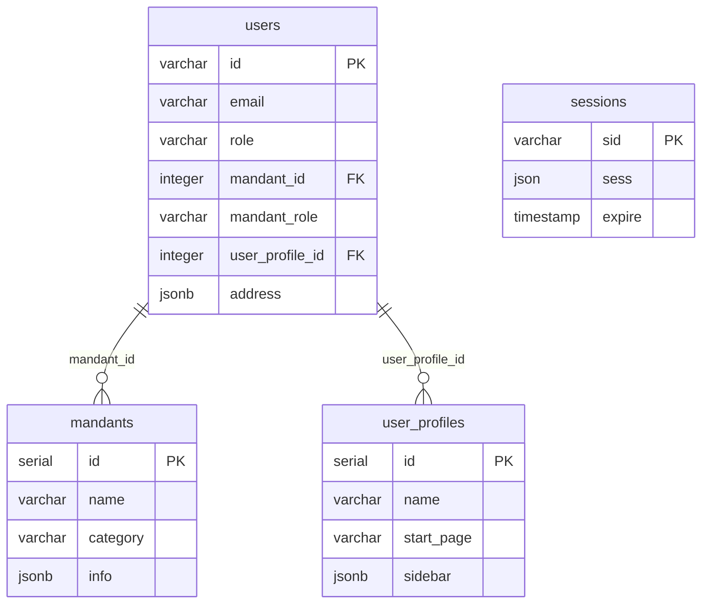

# Benutzerverwaltung - Dokumentation

## Übersicht

Das Benutzerverwaltungssystem basiert auf einer 4-Tabellen-Architektur in der Neon-DB und ermöglicht rollenbasierte Zugriffskontrolle, Mandanten-Management und flexible Profil-Berechtigungen.

## Database-Architektur

### 1. `users` - Hauptbenutzer-Tabelle
**Datensätze:** 7 Benutzer  
**Struktur:** 32 Spalten

#### Hauptfelder:
```sql
id                varchar     PRIMARY KEY (Replit User ID)
email             varchar     E-Mail-Adresse
first_name        varchar     Vorname
last_name         varchar     Nachname
username          varchar     Anmeldename
password          varchar     Passwort (gehasht)
role              varchar     Hauptrolle (viewer/user/admin/verwalter)
mandant_id        integer     FK → mandants.id
mandant_role      varchar     Mandanten-spezifische Rolle
user_profile_id   integer     FK → user_profiles.id
address           jsonb       Strukturierte Adressdaten
profile_image_url varchar     Avatar-URL
auto_id           serial      Auto-increment ID
created_at        timestamp   Erstellungsdatum
updated_at        timestamp   Änderungsdatum
```

#### Aktuelle Rollen-Hierarchie (Verifiziert):
- **superadmin**: Systemweiter Vollzugriff (höchste Ebene)
- **admin**: Mandanten-spezifische Administration
- **user**: Standard-Benutzer mit profilbasierten Berechtigungen

**Hinweis**: Die in dieser Dokumentation erwähnten Rollen `verwalter` und `viewer` sind nicht in der aktuellen Codebasis implementiert.

#### Mandanten-Rollen:
- **Besitzer**: Eigentümer von Objekten
- **Verwalter**: Verwaltung und Betrieb
- **Handwerker**: Wartung und Reparaturen
- **Betreuer**: Betreuung und Support
- **Energieberater**: Energieanalyse und Optimierung

### 2. `user_profiles` - Berechtigungsprofile
**Datensätze:** 1 Profil (Administrator)  
**Struktur:** 6 Spalten

#### Hauptfelder:
```sql
id          serial      PRIMARY KEY
name        varchar     Profilname (z.B. "Administrator")
start_page  varchar     Standard-Startseite ("/users")
sidebar     jsonb       Seitenleisten-Berechtigungen
created_at  timestamp   Erstellungsdatum
updated_at  timestamp   Änderungsdatum
```

#### Sidebar-Berechtigungen (JSONB):
```json
{
  "showUser": true,
  "showLogbook": true,
  "showDashboard": true,
  "showEnergyData": true,
  "showSystemSetup": true,
  "showNetworkMonitor": true,
  "showUserManagement": true,
  "showObjectManagement": true,
  "showGrafanaDashboards": true,
  "showEfficiencyStrategy": true
}
```

### 3. `mandants` - Mandanten-Verwaltung
**Datensätze:** 5 Mandanten  
**Struktur:** 7 Spalten

#### Hauptfelder:
```sql
id          serial      PRIMARY KEY
name        varchar     Mandantenname
description text        Beschreibung
category    varchar     Kategorie (siehe unten)
info        jsonb       Erweiterte Informationen
created_at  timestamp   Erstellungsdatum
updated_at  timestamp   Änderungsdatum
```

#### Mandanten-Kategorien:
- **Wohnungsgesellschaft**: Immobilienunternehmen
- **Verwalter**: Hausverwaltung
- **Betreiber**: Anlagenbetreiber
- **Handwerker**: Wartungsunternehmen
- **Betreuer**: Service-Provider

#### Info-Struktur (JSONB):
```json
{
  "adresse": {
    "strasse": "Musterstraße",
    "hausnummer": "123",
    "plz": "12345",
    "ort": "Musterstadt",
    "land": "Deutschland"
  },
  "kontakt": {
    "email": "info@beispiel.de",
    "telefon": "+49 123 456789",
    "fax": "+49 123 456788",
    "mobil": "+49 171 1234567",
    "website": "https://www.beispiel.de"
  }
}
```

### 4. `sessions` - Authentifizierung
**Datensätze:** 1.335 aktive Sessions  
**Struktur:** 3 Spalten

#### Hauptfelder:
```sql
sid     varchar     PRIMARY KEY (Session-ID)
sess    json        Session-Daten
expire  timestamp   Ablaufzeit
```

## Beziehungen



## Schema-Update durchgeführt

**✅ object_mandant Tabelle korrigiert (bezieht sich auf Objekt-Management):**
- `object_mandant.object_id` verwendet jetzt `objects.objectid` (echte Objekt-IDs)
- 21 Datensätze erfolgreich von serial IDs zu bigint objectid migriert  
- Konsistenz mit Portal-DB und Grafana-Integration hergestellt

## API-Endpoints

### Benutzer-Management:
- `GET /api/users` - Alle Benutzer (Admin-Zugriff)
- `GET /api/users/mandant` - Mandanten-spezifische Benutzer
- `GET /api/auth/user` - Aktueller Benutzer
- `POST /api/users` - Neuen Benutzer anlegen
- `PATCH /api/users/:id` - Benutzer bearbeiten
- `DELETE /api/users/:id` - Benutzer löschen

### Profile & Mandanten:
- `GET /api/user-profiles` - Alle Profile
- `GET /api/mandants` - Alle Mandanten
- `POST /api/mandants` - Neuen Mandanten anlegen

## Berechtigungskonzept

### Sidebar-Berechtigung "showUser":
- **Zugriff auf:** `/user` Seite
- **Funktion:** Mandanten-spezifische Benutzerliste
- **Filter:** Zeigt nur Benutzer des eigenen Mandanten

### Rollen-Matrix:
| Rolle | Vollzugriff /users | Mandanten-Filter /user | Profile bearbeiten |
|-------|-------------------|------------------------|-------------------|
| admin | ✅ | ✅ | ✅ |
| verwalter | ❌ | ✅ | ❌ |
| user | ❌ | ✅ | ❌ |
| viewer | ❌ | ✅ (nur lesen) | ❌ |

## Performance-Optimierung

### Aktuelle Metriken:
- **API-Response:** 200-400ms
- **SQL-Queries:** <100ms
- **Connection-Pool:** Stabil (10 max connections)
- **Session-Management:** 1.335 aktive Sessions

### Optimierungen:
1. **JSONB-Indexierung** für address und sidebar
2. **Connection-Pooling** mit 10s Timeout
3. **Mandanten-Filter** auf Database-Ebene
4. **Cached User-Profiles** für bessere Performance

## Sicherheitsaspekte

### Authentifizierung:
- **Replit Auth** Integration
- **Session-basiert** mit automatischer Ablaufzeit
- **Passwort-Hashing** für lokale Accounts

### Autorisierung:
- **Rollenbasierte Zugriffskontrolle**
- **Mandanten-Isolation**
- **Granulare Sidebar-Berechtigungen**

### Datenvalidation:
- **Zod-Schemas** für alle API-Inputs
- **TypeScript** für Type-Safety
- **JSONB-Validation** für strukturierte Daten

## Wartung & Monitoring

### Database-Status:
- Automatische **Connection-Health-Checks**
- **Fallback-Mechanismen** bei Verbindungsproblemen
- **Logging** aller Database-Operationen

### Performance-Monitoring:
- **Query-Performance** Tracking
- **API-Response-Times** Monitoring
- **Session-Cleanup** automatisch bei Ablauf

---

*Stand: August 2025 - Heimkehr e.G. Heizungsanlagen-Management*