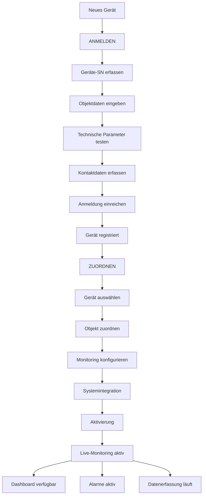

# Workflow: Device Management - Geräteverwaltung

## Übersicht
Die Geräteverwaltung umfasst zwei zentrale Prozesse für die Integration von Netzwächter-Geräten in das Heizungsanlagen-Management-System.

Workflow Inbetriebnahme
=> vorort Geräte installiert, aktiv wenn Stromversorgung, log sich autmatisch in Cloud sentinum, sendet aber keine Daten !
=> anmelden Gerät over Webseite /anmelden Punkt Geräteanmeldung
=> Sendet Daten ins  Portal zur Objekt-Übergabe
Es muss manuelle eine Zuordnung eines Mandanten, und Objekt? erfolgen (Strawa / oder Portal-Verwalter)
nach Zuordnung Mandant erfolgt Aktivierung Senden der Daten
Benachrichtung per email des Kunden / Verwalter / Mandanten per email
Der Admin des Mandanten bekommt email Gerät aktiv
Der Admin des Mandanten füllt weiter aus Objektdaten und Zuordnung von Benutzern 
Benutzern-Erstellung ! erfolgt durch den Mandanten
Über Benutzern-profile werden die Berechtigungen gesteuert


## 1. ANMELDEN - Geräteanmeldung

### Zweck
Registrierung neuer Netzwächter-Geräte im System für die Überwachung von Heizungsanlagen.

### Prozess-Schritte

#### 1.1 Geräte-Identifikation
- **Geräte-SN eingeben**: Seriennummer vom Gerätedeckel des Netzwächters
- **Visual Guide**: Hover-Funktion zeigt Referenzbild zur SN-Lokalisierung
- **Validierung**: Pflichtfeld, muss ausgefüllt werden

#### 1.2 Objektdaten erfassen
**Pflichtfelder:**
- **Objektbezeichnung**: Projekt-/Objektname
- **Installation-Ort/Raum**: Spezifischer Installationsort (Heizraum, Keller, etc.)

**Optionale Felder:**
- **Ort des Objektes**: PLZ, Straße, Ortsname
- **Auftrag/Lieferschein/Referenz Nr**: Referenznummer für Zuordnung

#### 1.3 Technische Parameter
**Funkverbindung testen:**
- ✅ **Gut**: Mehr als 2 Balken Handyempfang
- ⚠️ **Schlecht**: Weniger als 2 Balken Handyempfang
- **Auswirkung**: Beeinflusst Datenübertragungsqualität

#### 1.4 Kontaktinformationen
**Verantwortliche Person:**
- **Firmenname**: Installation/Wartung
- **Kontaktperson**: Verantwortlicher Name
- **E-Mail**: Benachrichtigungsempfänger

#### 1.5 Anmeldung abschließen
- **Validierung**: Alle Pflichtfelder prüfen
- **Submission**: Daten an Backend übertragen
- **Bestätigung**: "Geräteanmeldung erfolgreich eingereicht!"


---

## 2. ZUORDNEN - Gerätezuordnung

### Zweck
Assignment von registrierten Geräten zu spezifischen Objekten, Mandanten und Überwachungsbereichen im System.

### Prozess-Schritte

#### 2.1 Geräte-Auswahl
- **Registrierte Geräte anzeigen**: Liste aller angemeldeten, aber nicht zugeordneten Geräte
- **Geräte-Details**: SN, Registrierungsdatum, Status
- **Filterung**: Nach Registrierungsdatum, Status, Standort

Mandantzuordnung => erstelle oder Zuordnung

#### 2.2 Objekt-Zuordnung
**Zielobjekt definieren:**
- **Objektauswahl**: Aus bestehenden Portal-Objekten wählen
- **Mandanten-Zuordnung**: Automatisch basierend auf Objektzugehörigkeit
- **Berechtigungsprüfung**: Nur berechtigte Objekte anzeigen

#### 2.3 Monitoring-Konfiguration
**Überwachungsparameter festlegen:**
- **Schwellwerte**: Temperatur-, Verbrauchslimits
- **Alarmkonfiguration**: Benachrichtigungsregeln
- **Messintervalle**: Datenerfassungsfrequenz
- **Dashboard-Integration**: Grafana-Panel-Zuordnung

#### 2.5 Aktivierung
- **Konfiguration validieren**: Alle Parameter prüfen
- **Live-Monitoring starten**: Datenerfassung aktivieren
- **Status-Update**: Gerät auf "Aktiv" setzen
- **Benachrichtigung**: Kontaktperson informieren

### System-Integration
```typescript
// Datenstruktur für Gerätezuordnung
interface DeviceAssignment {
  deviceId: string;           // Geräte-SN
  objectId: number;           // Portal-Objekt-ID
  mandantId: number;          // Mandanten-ID
  assignedBy: string;         // Zuweisende Person
  assignmentDate: Date;       // Zuweisungsdatum
  monitoringConfig: {
    temperatureThresholds: {
      min: number;
      max: number;
      critical: number;
    };
    alertSettings: {
      email: string[];
      sms?: string[];
      escalationTime: number;
    };
    dashboardConfig: {
      grafanaPanelId?: string;
      displayName: string;
    };
  };
}
```

---

## Workflow-Übersicht



---

## Status-Übersicht

| Status | Beschreibung | Nächster Schritt |
|--------|--------------|------------------|
| **Neu** | Gerät physisch verfügbar | → ANMELDEN |
| **Registriert** | Anmeldung abgeschlossen | → ZUORDNEN |
| **Zugeordnet** | Objekt-Assignment erfolgt | → Konfiguration |
| **Konfiguriert** | Monitoring-Setup abgeschlossen | → Aktivierung |
| **Aktiv** | Live-Monitoring läuft | → Betrieb |
| **Fehler** | Problem in Workflow | → Diagnose |

---

## Berechtigungen

### ANMELDEN
- **Alle Benutzer**: Können Geräte anmelden
- **Validierung**: Automatische Duplikatsprüfung
- **Approval**: Admin-Freigabe bei kritischen Fällen

### ZUORDNEN
- **Admin-Berechtigung**: Vollzugriff auf alle Objekte
- **Mandanten-User**: Nur eigene Mandanten-Objekte
- **Viewer**: Nur Ansichtsberechtigung

---

## Technische Anforderungen

### Hardware
- **Netzwächter-Gerät**: Mit eindeutiger Seriennummer
- **Mobilfunk-Empfang**: Mindestens 2 Balken empfohlen
- **Installationsort**: Zugänglich für Wartung

### Software
- **Portal-DB-Zugriff**: Objekt- und Mandantendaten
- **Grafana-Integration**: Dashboard-Erstellung
- **E-Mail-Service**: Benachrichtigungssystem
- **API-Verfügbarkeit**: Backend-Integration

---

*Workflow-Version: 1.0 | Erstellt: September 2025 | System: Heizungsanlagen-Management*